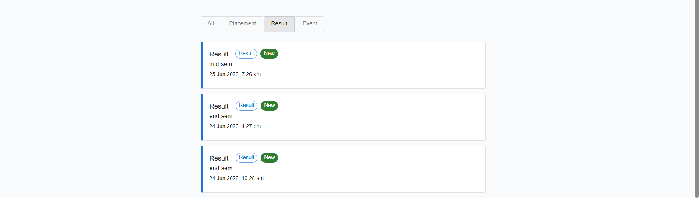
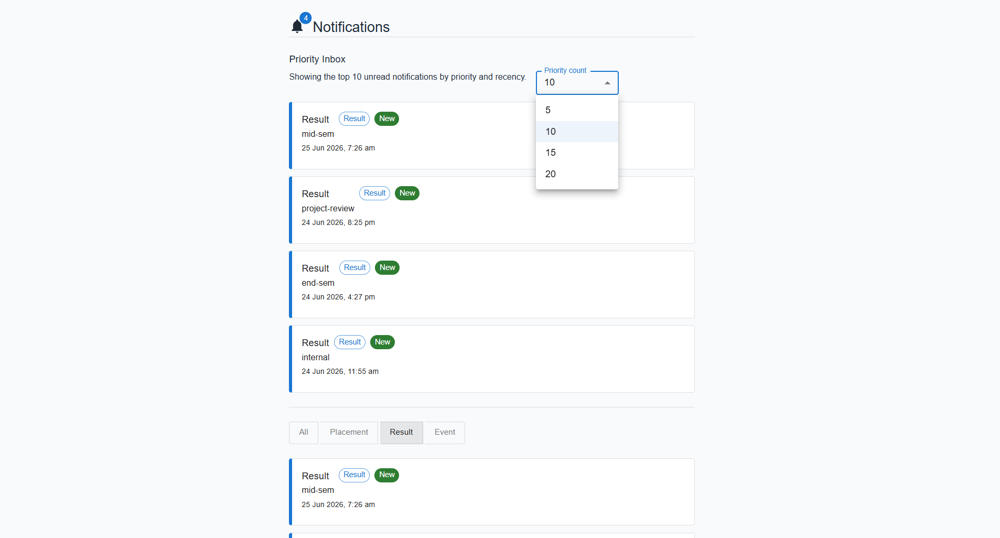
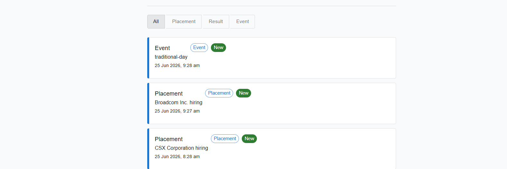
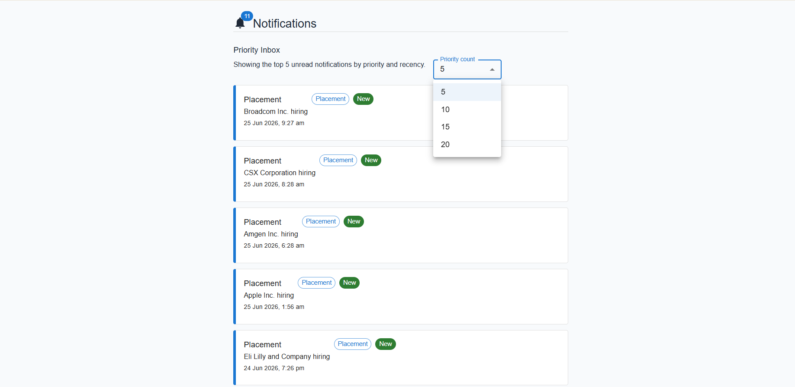

# Notification System

## Overview

This project enhances the campus notification application by introducing a Priority Inbox that highlights the most important unread notifications based on notification priority and recency.

The application supports notification filtering, configurable priority counts, unread notification tracking, and a clean user interface for better user experience.

---

# Stage 1 - Priority Inbox

## Features Implemented

### Priority Inbox

A dedicated Priority Inbox section has been added to display the most important unread notifications.

### Configurable Priority Count

Users can choose how many notifications should appear in the Priority Inbox.

Supported values:

- 5
- 10
- 15
- 20

### Notification Categories

The system supports:

- Placement
- Result
- Event

### Notification Filtering

Users can filter notifications using:

- All
- Placement
- Result
- Event

### Unread Notifications

Unread notifications are identified using a **New** badge.

---

## Priority Logic

Notifications are ranked using:

1. Notification Type Priority
2. Recency

Priority Order:

| Notification Type | Priority |
|------------------|----------|
| Placement | High |
| Result | Medium |
| Event | Low |

Example:

```text
Placement (Latest)
Placement (Older)
Result (Latest)
Result (Older)
Event
```

---

## Screenshots

### Priority Notifications



Displays the highest priority unread notifications.

---

### Priority Count Dropdown



Allows users to select the number of priority notifications to display.

---

### Notification Filters



Users can filter notifications by category.

---

### Complete Priority Inbox View



Shows the Priority Inbox with configurable notification count.

---

## Efficient Top N Maintenance

To efficiently maintain the top notifications as new notifications arrive:

- Notifications are assigned a priority.
- Notifications are sorted based on:
  - Type Priority
  - Timestamp
- The top N notifications are displayed in the Priority Inbox.

# Stage 2 - Production Ready Notification Application

## Features Implemented

### All Notifications Page

Displays all notifications retrieved from the API.

### Priority Notifications Page

Displays the top N unread notifications based on priority and recency.

### Notification Type Filtering

Supports filtering by:

- Placement
- Result
- Event

### Viewed and Unviewed Notifications

The frontend maintains notification state and visually distinguishes:

- New Notifications
- Viewed Notifications

### Pagination

Integrated support for:

```text
page
limit
```

API Query Example:

```text
?page=1&limit=10
```

### API Filtering

Integrated support for:

```text
notification_type
```

API Query Example:

```text
?page=1&limit=10&notification_type=Placement
```

### Logging Middleware

Integrated logging middleware across API calls and application flows to assist with debugging and monitoring.

### Error Handling

Implemented:

- Loading states
- Empty states
- API failure handling
- Invalid response handling

### Responsive Design

The application is responsive and works on:

- Desktop
- Tablet
- Mobile

### Material UI

Material UI components are used throughout the application for:

- Layout
- Navigation
- Cards
- Forms
- Pagination
- Responsive UI

---

## Technology Stack

- React
- Material UI
- Axios
- React Router
- JavaScript

---

## Outcome

The implemented solution successfully:

- Displays all notifications.
- Displays priority notifications.
- Supports configurable Top N values.
- Supports notification type filtering.
- Distinguishes viewed and unviewed notifications.
- Supports pagination.
- Integrates logging middleware.
- Handles API errors gracefully.
- Provides a responsive and user-friendly interface.